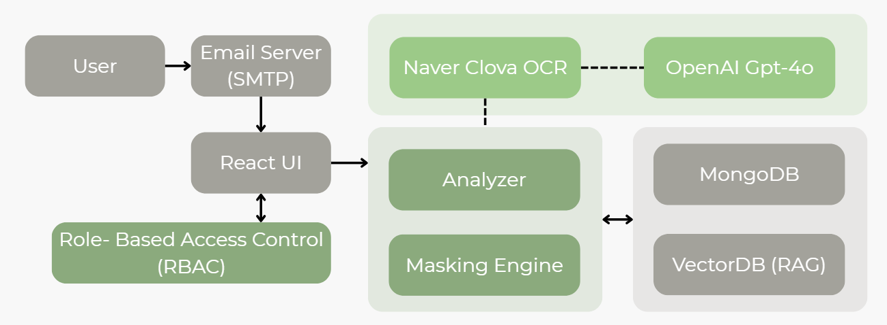

# MASKIT

<div align="center">


</div>

# MASKIT - 기업용 이메일 PII 마스킹 AI Agent

> **서울여자대학교 정보보호학과 종단형 PBL 프로젝트 (팀: 헨젤과 그레텔)** <br/>
> **개발기간: 2025.03 ~ 2025.12**

## 목업 사이트

> GitHub : [https://guardcap.github.io/maskit-landing-page/](https://guardcap.github.io/maskit-landing-page/)

## 팀 소개

| 정지윤 | 육은서 | 이시온 |
|:---:|:---:|:---:|
| 서울여자대학교 정보보호학과 | 서울여자대학교 정보보호학과 | 서울여자대학교 정보보호학과 |

## 프로젝트 소개

MASKIT은 기업 이메일 환경에서 **PII(개인 식별 정보) 탐지·정책 판단·파일 마스킹** 과정을 자동화하는 AI Agent입니다.

개인정보보호위원회 통계에 따르면 2024년 국내 개인정보 유출 신고 건수 307건 중 업무 과실이 30%를 차지합니다. 파일 오첨부, 마스킹 누락 등 반복적인 인간 실수를 AI Agent로 대체하여 보안 사고를 예방하고 업무 효율을 높이고자 개발하였습니다.

MASKIT은 RAG 기반 AI가 개인정보보호법, GDPR 등 법령 및 사내 정책을 참조하여 각 PII 항목의 마스킹 필요 여부를 판단하고, 사용자가 최종 검토 후 마스킹된 이메일을 전송할 수 있도록 합니다.

## 주요 기능 


### 하이브리드 PII 탐지 엔진
- Regex + 한국어 특화 NER(koelectra) + OCR 결합
- 주민등록번호, 여권번호, 운전면허번호, 전화번호, 신용카드번호, 계좌번호 등 대한민국 표기 체계에 맞춘 개인정보 탐지 기본 내장
- 중복 엔티티 우선순위 로직으로 오탐 최소화

### RAG 기반 LLM 정책 판단
- VectorDB에서 관련 보안 가이드라인을 검색하여 LLM이 마스킹 여부를 판단
- 사내/사외 발신, 수신자 유형 등 컨텍스트 기반 유연한 마스킹 결정
- 단순 차단이 아닌 AI 판단 근거 제시

### 좌표 기반 무손실 파일 마스킹
- PDF: 텍스트 검색 + instance_index로 정확한 위치 특정
- 이미지(jpg, png): OCR bbox 좌표 기반 직접 마스킹
- 원본 문서 레이아웃 보존

### 멀티모달 정책 자동 처리
- PDF/이미지 형태 정책 문서 업로드 → GPT-4o Vision으로 텍스트 추출
- LLM이 핵심 가이드라인 자동 추출 → MongoDB + OpenAI Vector Store 저장
- 개발 지식 없이도 보안 정책 최신 상태 유지

### 역할 기반 접근 제어 (RBAC)
- System Admin / Policy Admin / Auditor / User 4단계 역할 분리
- JWT 기반 인증, 최소 권한 원칙 적용
- 전체 활동 감사 로그 기록

---

## Stacks 

### Backend


### Frontend


### AI / ML


### Communication


---

## 아키텍처

## System Architecture



### 디렉토리 구조

```bash
maskit/
├── backend/
│   └── app/
│       ├── main.py                  # FastAPI 앱 진입점
│       ├── auth/                    # 인증·사용자 관리
│       │   ├── auth_utils.py        # JWT 토큰, 권한 체크
│       │   ├── routes.py            # 로그인, 회원가입
│       │   └── users.py             # 사용자 CRUD
│       ├── api/
│       │   └── settings.py          # SMTP·이메일 설정 API
│       ├── audit/                   # 감사 로그
│       │   ├── logger.py
│       │   ├── models.py
│       │   └── routes.py
│       ├── entity/                  # PII 엔티티 관리
│       │   └── routes.py
│       ├── policy/                  # 정책 문서 관리
│       │   ├── models.py
│       │   ├── routes.py
│       │   └── background_tasks.py  # 가이드라인 추출·VectorDB 임베딩
│       ├── vectordb/                # RAG 마스킹 결정
│       │   ├── rag_masking.py       # OpenAI 기반 마스킹 판단
│       │   └── routes.py
│       ├── smtp_server/             # SMTP 수신·발신
│       │   ├── handler.py
│       │   ├── client.py
│       │   └── routes.py
│       ├── routers/
│       │   ├── analyzer.py          # PII 분석 
│       │   ├── emails.py            # 이메일 CRUD 
│       │   ├── masking_pdf.py       # 첨부파일 마스킹 
│       │   ├── ocr.py               
│       │   └── uploads.py          
│       ├── llm/
│       │   └── masking_prompter.py  # LLM 프롬프트 생성·파싱
│       ├── rag/                    
│       └── utils/
│           ├── recognizer/          # 규칙 기반 PII 인식기 (전화, 이메일 등)
│           ├── ner/                 # koelectra NER 엔진
│           ├── masking_engine.py    # PDF·이미지 마스킹
│           ├── masking_rules.py     # 마스킹 규칙 정의
│           └── recognizer_engine.py # 통합 분석 엔진
│
└── frontend/
    └── src/
        ├── App.tsx                  # 라우팅 및 레이아웃
        ├── pages/
        │   ├── LoginPage.tsx
        │   ├── WriteEmailPage.tsx   # 메일 작성
        │   ├── MaskingPage.tsx      # 마스킹 검토·전송
        │   ├── SentEmailsPage.tsx   # 보낸 메일함
        │   ├── ReceivedEmailsPage.tsx
        │   ├── UserDashboardPage.tsx
        │   ├── AuditorDashboardPage.tsx
        │   ├── PolicyListPage.tsx
        │   ├── EntityManagementPage.tsx
        │   ├── UserManagementPage.tsx
        │   ├── DecisionLogsPage.tsx # 프라이버시 보호 이력
        │   └── MyPage.tsx           # 프로필·SMTP 설정
        ├── components/
        └── lib/
            └── api.ts               # 백엔드 API 클라이언트

```

---

## 시작 가이드

### Requirements

- [Node.js 18+](https://nodejs.org/)
- [Python 3.11+](https://www.python.org/)
- [MongoDB](https://www.mongodb.com/)
- [OpenAI API Key](https://platform.openai.com/)
- [Naver Clova OCR API Key](https://api.ncloud-docs.com/docs/ai-application-service-ocr)

### Installation

```bash
git clone https://github.com/guardcap/MASKIT-pub.git
cd MASKIT-pub
```

#### Backend

```bash
cd backend
pip install -r requirements.txt
cp .env.example .env # .env 파일 설정
uvicorn app.main:app --reload
```

#### Frontend

```bash
cd frontend
npm install
npm run dev
```


